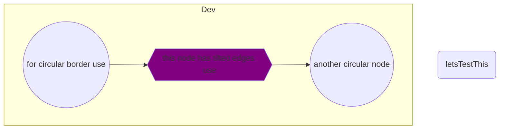

# fullstackopen

```mermaid
flowchart TD;

    setup_dev(letsTestThis)
  subgraph Dev
    bci{{this node has tilted edges use}}
    style bci fill:purple
    style bci font:black
    whatever --> bci
    bci --> whatever1
    whatever((for circular border use  ))
    whatever1((another circular node))
end
```